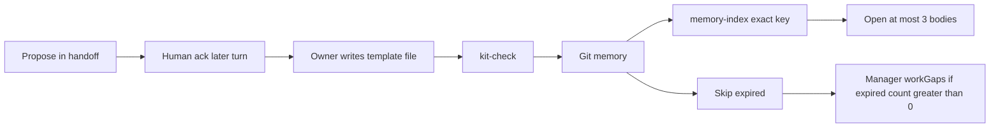

# Agent memory

**Short notes agents can look up later** — not a second catalog. Open a file only when the entity matches this turn. Write only after a person approves. Memory is **advisory**: inventory, USAGE, RATIONALE, and Storybook remain source of truth for what exists.

Reviewed Git files under `.agents/memory/`. Isolation key: `(repoRoot, pack id)`. Pack `id` is not the checkout folder name.

Cursor Agents/chat lists are **not** memory and **do not** follow a folder rename (they are keyed to a workspace storage id from the folder URI). Do not copy Cursor databases to preserve context. Put lasting notes in git: this tree after ack, plus inventory, program board, and docs. [EXAMPLE-HOST.md](EXAMPLE-HOST.md#names-paths-and-durable-context).

Bootstrap `--write` and kit upgrade seed **empty** namespaces (`.gitkeep` only). They never copy records from another pack.

## What it is not

- Playbooks, `packSkills`, kit `critique-standards.md` (portable industry bar)
- The program board under `.agents/program/` (Manager only)
- Handoffs under `.agents/handoffs/` until reviewed and reduced
- Chat transcripts, Cursor `@Chats`, other packs’ memory or Figma
- Embedding / vector / cosine search over `.agents/memory/` — retrieve by **exact** frontmatter keys only

## Layers (directories)

| Layer | Where | Who writes (after ack) |
| --- | --- | --- |
| Working | This hop’s JIT must-read, handoff, program board | Not git memory |
| Semantic | `.agents/memory/shared/` | Docs (`ds-docs`) |
| Procedural (owner) | `ds-architect/`, `ds-coding/`, `ds-critique/` | That agent only |
| Episodic | `ds-bugbot/`, `ds-security/`, `ds-a11y/` | That review agent only |

Always-on procedural (playbooks, `packSkills`, inventory, Storybook) is **not** memory. Kit `critique-standards.md` is portable industry bar, not host memory. The program board under `.agents/program/` is not memory; Manager writes only `.agents/program/`.

## Layout

- `shared/` — one short catalog fact per public entity after human ack (`agent: ds-docs`)
- `ds-architect/` — short harvest lessons (near-miss, twin avoided, job→entity) after human ack
- `ds-coding/` — short implementation lessons (wrap gotcha, story matrix, test pattern) after human ack
- `ds-critique/` — short **Critique-hop** lessons and user instructions after human ack (not full critique essays). Producers must not read this namespace.
- `<agent-id>/` — pointer notes for Bugbot, Security, or Accessibility evidence after human ack

Empty folders for Prototype, Language, Manager, Release, and the `ds-docs/` stub stay unused — unused stubs / isolation stubs, not diaries. kit-check fails if those stubs contain `.md` records.

## Lifecycle



1. **Propose** this turn in a handoff or inventory proposal — do not rewrite existing memory while shipping.
2. **Ack** in a **later** turn (explicit human).
3. **Write** one atomic, template-shaped file in the owner namespace. For `shared/`, one file per entity slug; set `supersedes:` and replace in place — never a twin file for the same entity.
4. **Retrieve** by exact key (`entities` / `entity`, `trigger`, `subjectAgent`, or filename stem). Skip expired (`expiresAt` before today).
5. **Manage** when Manager sees `memoryExpired > 0` under `workGaps`: supersede or discard after ack. Do not merge/delete in the ship turn.

## Selectivity

Memory is a **small retrieval index**, not a second catalog. Prefer omitting a record over a verbose one.

**Write to `shared/` (ds-docs only, after ack):** one file per entity slug; frontmatter plus ~15–25 lines; required body fields only. Shipper (Architect after extract/enhance confirm, Coding after HITL) proposes in a handoff or inventory proposal; do not write in the implementation or promotion turn.

**Write to `ds-architect/` (Architect only, after ack):** harvest near-miss, twin avoided, or job→entity mapping inventory cannot express — from `references/architect-lesson.md`. Never in the same turn as the harvest decision. Never paste USAGE, RATIONALE, or harvest maps.

**Write to `ds-coding/` (Coding only, after ack):** wrap/gotcha, story matrix, or test pattern tests did not encode — from `references/coding-lesson.md`. Never in the same turn as the implementation. Never paste USAGE, RATIONALE, or diffs.

**Write to `<agent-id>/` (review agents only, after ack):** path, severity, PR or handoff id — not full axe dumps or review essays. Template: `references/review-pointer.md`.

**Write to `ds-critique/` (Critique only, after ack):** short pack lessons for the **next Critique hop** from `references/critique-lesson.md`. Producer-facing bars must be **routed** (see Critique routing) into `architect-lesson`, `coding-lesson`, or `shared-fact` — not left only under `ds-critique/` when the actor needs them. Producers must not pre-seed or read `ds-critique/`. Critique must not read producer namespaces (`ds-architect`, `ds-coding`, …).

**Never memory:** inventory, USAGE, RATIONALE, harvest maps, program board, handoffs (until reviewed and reduced), token tables, secrets, chat transcripts.

## Retrieval

Session-start (Cursor) prints **shared titles** (cross-agent bus) and **counts** per namespace (`architect=N coding=N critique=N …`). It does **not** dump Architect, Coding, or Critique title strings into every chat. Owners list their own directory titles on that hop, or run `node scripts/kit/memory-index.mjs --namespace <id>`. Optional exact filter (`memory-index --match`): `node scripts/kit/memory-index.mjs --match <slug-or-trigger>` (case-insensitive equality on `entities` / `entity` / `trigger` / `subjectAgent` / filename stem; skips expired).

Do **not** load every file under `.agents/memory/`. Skip expired records (`expiresAt` before today). Open at most **3** matching non-expired bodies — **open on match** only.

- Open a `shared/*.md` only when this turn’s entity matches — open on match only.
- Open `ds-architect/*.md` or `ds-coding/*.md` only when that agent owns the hop and slug / `trigger` / entity matches.
- Open `ds-critique/*.md` only on a Critique hop when `subjectAgent` / `trigger` / entity matches. **Producers never open `ds-critique/`.**
- Open review-namespace files only when recording/acking evidence or the user asked about a prior finding.
- Never open producer memory namespaces from Critique.

Inventory and Storybook remain source for what exists. Match keys live in frontmatter (`entities` / `entity`, `trigger`, `subjectAgent`) so the index need not open bodies.

Templates: `.agents/agents/references/catalog-fact.md`, `references/architect-lesson.md`, `references/coding-lesson.md`, `references/critique-lesson.md`, `references/review-pointer.md`.

Architect/Coding provenance for JIT search and red→green: [AGENT-ARCHITECT-CODING.md](AGENT-ARCHITECT-CODING.md).

## Critique routing (`proposedLessons`)

When Critique proposes a standing bar, route it so the **actor** can read it later:

| Route | Meaning | Who writes after later ack |
| --- | --- | --- |
| `critique-only` | Reviewer lesson for the next Critique hop | Critique → `ds-critique/` |
| `architect-lesson` | Producer harvest bar | Architect → `ds-architect/` |
| `coding-lesson` | Producer impl bar | Coding → `ds-coding/` |
| `shared-fact` | Cross-agent catalog bar | Docs → `shared/` |

Do not store a producer-facing bar only under `ds-critique/` when `subjectAgent` is a producer — Coding/Architect must not open Critique’s namespace.

## Frontmatter

Every record:

```yaml
---
designSystemId: <pack-id>
agent: ds-docs
title: Heading group catalog fact
evidence: <paths.primitives>/heading-group/USAGE.md
decision: enhanced
applicability: this pack
source: PR
owner: <ack reviewer>
reviewedAt: 2026-08-21
expiresAt: 2027-08-21
entities: heading-group
supersedes:
---
```

Lesson records also carry `trigger:` (and critique lessons `subjectAgent:`) in frontmatter. Body `lessonKind` holds subtypes (`near-miss`, `wrap-gotcha`, `pack-lesson`, …) — not a second CoALA type field. Review pointers carry `severity:` (`blocking` \| `important` \| `nit`).

### What kit-check fails

`node scripts/kit/check.mjs` validates path-aware records under `.agents/memory/`:

- Missing or mismatched `designSystemId`, `owner`, `reviewedAt`, or `expiresAt`; missing `evidence` on path-aware files; secrets patterns
- `agent:` must match the namespace (`shared/` → `ds-docs`; owner dirs → that agent id)
- Unused stubs (`ds-docs/`, `ds-prototype/`, `ds-language/`, `ds-manager/`, `ds-release/`) must not contain `.md`
- Nested directories or `.md` at `.agents/memory/` root fail; unknown namespace dirs fail
- `shared/` requires frontmatter `entities`/`entity` matching the filename (no filename-only fallback); duplicate entity slugs fail
- Lessons require `trigger` (Critique also `subjectAgent`); review pointers require `severity`
- Body after frontmatter must stay ≤ 50 lines; required body labels per template; no `oklch(`, hex colors, or fenced axe dumps in the body

Past `expiresAt` does **not** fail the check; retrieval skips those records and a manage hop may supersede them. Do not write secrets.

## Forbidden retrieval

Other design systems’ chats, `@Chats`, `~/.cursor` notes, other Figma files. v1 refuses imports. No embedding search over this tree.

Handoffs in `.agents/handoffs/` are not memory until reviewed.

## Catalog facts

After a new or enhanced catalog entity passes human review, the specialist who shipped it **proposes** the fact and waits for explicit human acknowledgement. **Documentation (`ds-docs`)** writes the reviewed record under `.agents/memory/shared/` in a **later** acknowledged turn. Do not write memory in the same turn as the implementation or promotion, and do not treat a handoff as memory.

Filename is `.agents/memory/shared/<entity-slug>.md`. Frontmatter `entities` (or `entity`) must match that slug. The record body must include:

- `entity` — public entity name and source path
- `layer` — stock UI, primitive, block, or other catalog layer
- `decision` — new, enhanced, reused, replaced, or retired
- `reuse-of` for a new composition based on an existing entity, or `changed-API` for an enhancement
- `do-not-clone` — the contract or use case future work must reuse instead of duplicating
- `story` — exact Storybook title or stable story id used as evidence

Human acknowledgement must be recorded in the frontmatter (`owner`, `reviewedAt`, and evidence/source). If acknowledgement has not happened, keep the proposal in a handoff or inventory proposal, not memory.

## Producer lessons

Architect and Coding may grow pack performance by storing short own-namespace lessons after ack. Cross-agent knowledge still travels through `shared/` only. Loading every lesson “for context” as the pack grows is forbidden — that hurts performance.

## Why this shape

Keep the standing prompt small (Anthropic JIT / context engineering). Persist only durable, explicit, inspected notes — OpenAI’s “memory is not the memo”; the reviewed catalog artifact stays truth. Exact-key retrieve only: embedding RAG over a writable store is a poisoning surface (PoisonedRAG, OWASP LLM08). Details: [AGENT-ARCHITECT-CODING.md](AGENT-ARCHITECT-CODING.md).
